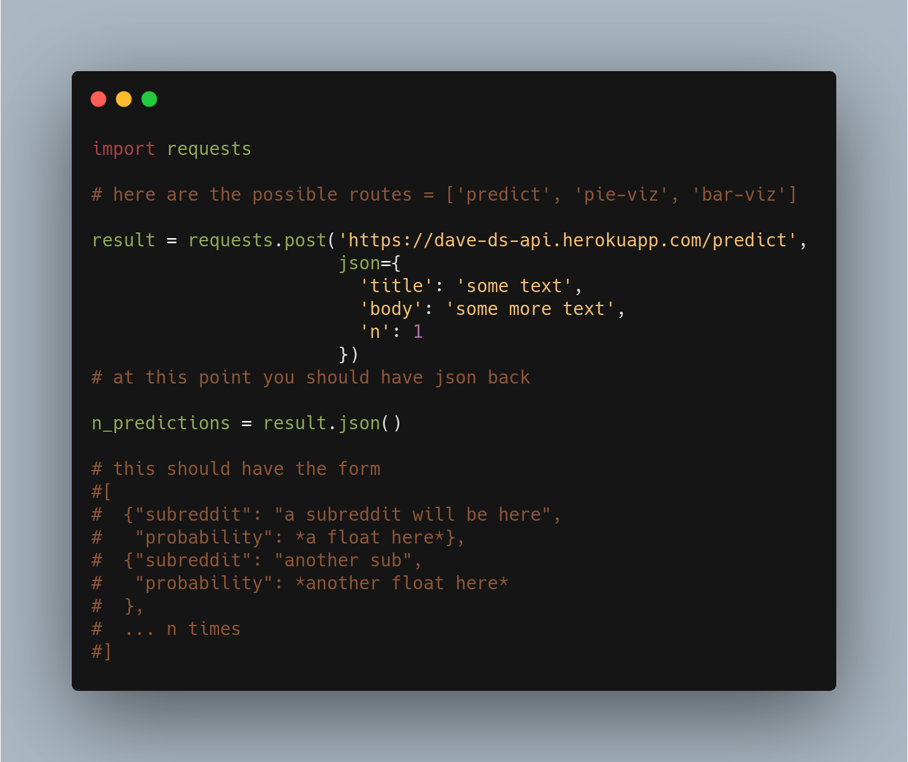

# DS

This is the data science repository for the unit 3 Cross Functional Build week

# What it does
Makes a fast-api with 3 routes
- predict, feeds data into an SGD Classifier returns [{'subreddit': prediction, 'probability': proba}, {}...]
- pie-viz, makes a pie chart out of the models predict_proba method *not great visually...*
- bar-viz, makes a horizontal bar chart out of the models predict_proba method

# What's in here
3 main directories

- /app contains
  - metadata
  - routes
  - tests
- /database
  - queries : creates a postgres table, inserts data
  - reddit : gets data from the reddit api
- /notebooks
  - ipython notebooks containing EDA and model evaluations

# FAQ
- Where's the model?

The trained model file exceeds github's file size restrictions, 
so it is currently hosted here: https://drive.google.com/file/d/10qX6GrKbzBHupMYJ4W6K_CYRYVI_ZPng/view?usp=sharing

Label encoder here: https://missing-url.com

Make sure you download the sgd model AND the label encoder, place them in app/api/

- Where can we find the api?

Here : https://dave-ds-api.herokuapp.com/

- What about the database?

I think we should probably publish to kaggle, could be used for some interesting analysis later.

- Why can't I see the graph?

This was intended to be sent to JS people so they would need to use plotly JS to render the graphs but if you run it 
locally the graphs will open in a new tab.

- How to use this locally
  - Use pipenv
  - pipenv shell
  - pipenv update
  - run this command : uvicorn app.main:app --reload

- How can I use the deployed api?

Through this link: https://dave-ds-api.herokuapp.com/

You could read the Swagger docs but those need to be improved so here's an example in python:

